---

# Universal Recipe Manager Guide

---

## Contents

1. [Introduction](#introduction)
2. [After installation](#after-installation)
    - [Windows](#windows)
    - [Mac](#mac)
    - [Linux](#linux)
3. [Home](#home)
4. [Create](#create)
5. [Show](#show)
6. [Edit](#edit)
7. [Other features](#other-features)

## Introduction

This guide will cover all views of application.

**Note:** Every image has numbers in red circles inside. These numbers are related to list below.

---

## After installation

### Windows

**Note:** These actions works also for portable edition.

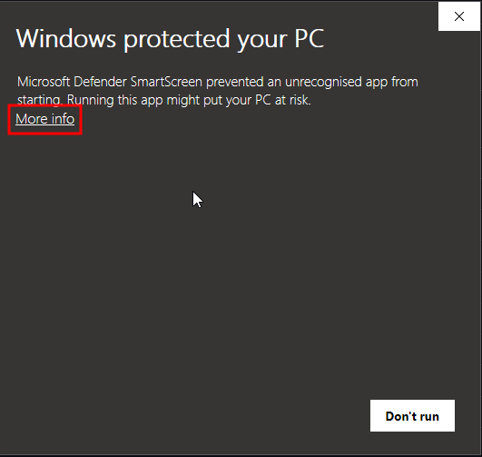

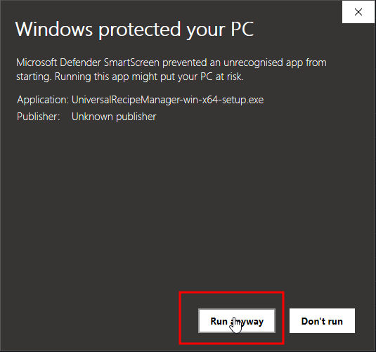

### Mac

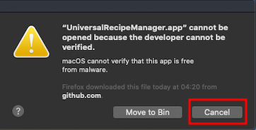

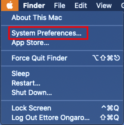

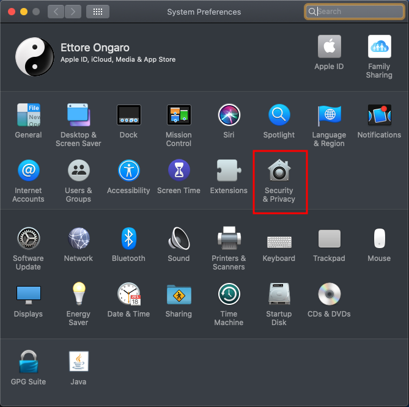

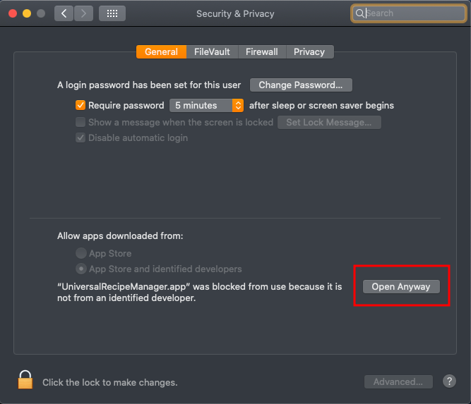

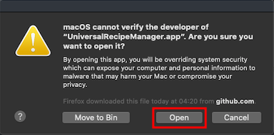

## Linux

Run once to apply mime types.

---

## Home

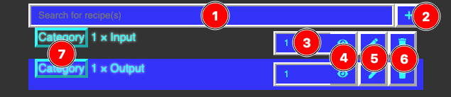

1. Search bar: search for recipe(s)
2. Add/Import button: see [Create](#create) section
3. Recipe amount: used to set amount to [showing](#show) a specific recipe
4. Show recipe: see [Show](#show) section
5. Edit recipe: see [Edit](#edit) section
6. Delete recipe: remove recipe from list and destroy its file
7. Recipe category: define a category for the recipe (optional)

---

## Create

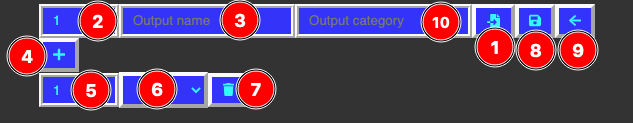

1. Import recipe(s): import previously created recipe(s)
2. Output quantity: how many items do the recipe made
3. Output name: visual identifier of recipe
4. Add input: add input to inputs' section*
5. Input quantity: how many items do the recipe need*
6. Input list: permit selecting previously created recipes*
7. Delete input: destroy current input*
8. Save and close: save recipe and go back to [home](#home)
9. Close without saving: doesn't save recipe and go back to [home](#home)
10. Recipe category: used to define the recipe's category (optional)

***Caution:** These steps aren't needed to generate "not-craftable" items!

---

## Show

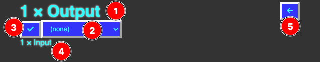

1. Recipe heading: contains amount selected and recipe output
2. Group by: group inputs with specific rules
3. Toggle precision: toggle precision mode, useful when inputs are fractional
4. Input list: all inputs needed to create the recipe, as tree view
5. Back: return to [home](#home)

---

## Edit

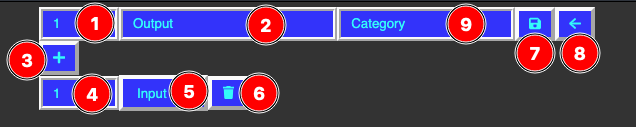

1. Output quantity: how many items do the recipe made
2. Output name: visual identifier of recipe
3. Add input: add input to inputs' section*
4. Input quantity: how many items do the recipe need*
5. Input list: permit selecting previously created recipes*
6. Delete input: destroy current input*
7. Save and close: save recipe and go back to [home](#home)
8. Close without saving: doesn't save recipe and go back to [home](#home)
9. Recipe category: used to define the recipe's category (optional)

***Caution:** These steps aren't needed to generate "not-craftable" items!

---

## Other features

- Opening a recipe (**.urmrecipe**) or lang (**.urmlang**) file with app will import it/those
    - Same result can be obtained by calling app executable in CLI and with parameters all the files to import
- Expanding lang support is possible by take a previous lang file and replace all values (**NOT**
  keys!)

---